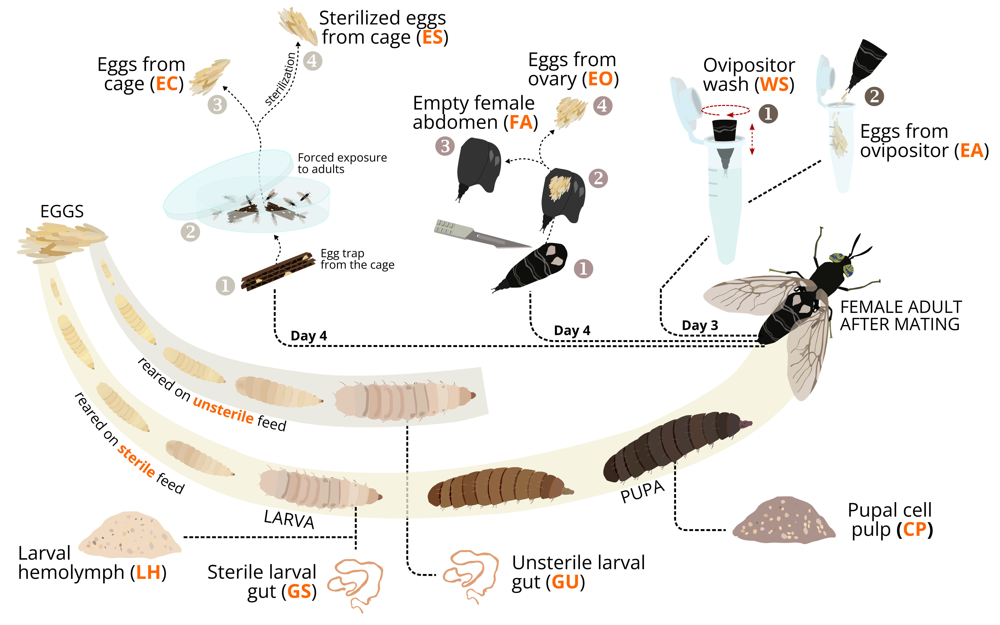

# Microbial influences on black soldier fly reproduction: A focus on egg surface colonization

*Preprint available at Research Square*  

Heussler, C.D.*, Klammsteiner, T.\*, Stonig, K.T., Insam, H., Schlick-Steiner, B.C., Steiner, F.M.  

Reproducible documentation for analyzing the microbiome involved in black soldier fly reproduction and oviposition.

Published on: 05.09.2023  
DOI: [doi.org/10.21203/rs.3.rs-3314156/v1](https://doi.org/10.21203/rs.3.rs-3314156/v1)  

Link to documentation: [tklammsteiner.github.io/eggsurfacemicrobiome](https://tklammsteiner.github.io/eggsurfacemicrobiome)
