```{r setup, include=FALSE}
knitr::opts_chunk$set(echo = TRUE)
```

<style>
  body {text-align: justify}
</style>

## **Sequence processing**

### Prepare environment
#### Load packages
```{r packages16S, warning=F, message=F, eval=FALSE}
library(tidyverse); packageVersion('tidyverse')
library(reshape2); packageVersion('reshape2')
library(ampvis2); packageVersion('ampvis2')
library(phyloseq); packageVersion('phyloseq')
library(microbiomeMarker); packageVersion('microbiomeMarker')
library(microbiome); packageVersion('microbiome')
library(RColorBrewer); packageVersion('RColorBrewer')
library(vegan); packageVersion('vegan')
library(ggpubr); packageVersion('ggpubr')
library(MicEco); packageVersion('MicEco')
library(RVAideMemoire); packageVersion('RVAideMemoire')
```

#### Set path and gather samples
```{r eval=FALSE}
path <- "...set path to your read files..."
list.files(path)

fnFs <- sort(list.files(path, pattern="_R1_001_trimmed.fastq", full.names = TRUE))
fnRs <- sort(list.files(path, pattern="_R2_001_trimmed.fastq", full.names = TRUE))

sample.names <- sapply(strsplit(basename(fnFs), "_"), `[`, 1)
```

<br/>

### Quality profiles of raw reads
```{r eval=FALSE}
plotQualityProfile(fnFs[1:2])

```

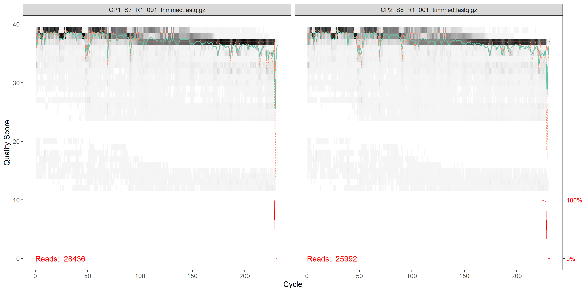

```{r eval=FALSE}
plotQualityProfile(fnRs[1:2])
```

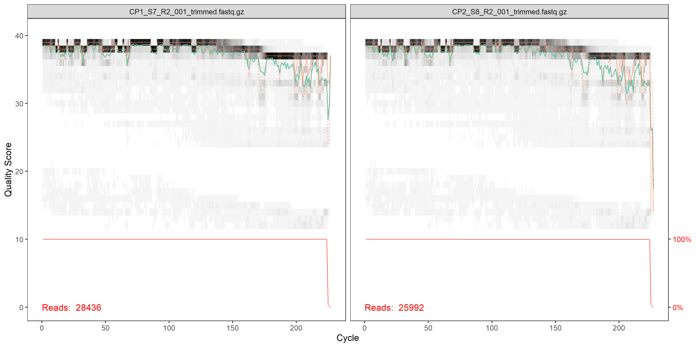

<br/>

### Filter raw reads
```{r eval=FALSE}
filtFs <- file.path(path, "filtered", paste0(sample.names, "_F_filt.fastq.gz"))
filtRs <- file.path(path, "filtered", paste0(sample.names, "_R_filt.fastq.gz"))

out <- filterAndTrim(fnFs, filtFs, fnRs, filtRs, truncLen=c(225,220),
                     maxN=0, maxEE=c(2,2), truncQ=2, rm.phix=TRUE,
                     compress=TRUE, multithread=FALSE)

out
```

```{r echo=F, warning=F, message=F}
library(reactable)
library(htmlwidgets)

out <- read.csv("output/16S-out.csv", sep = ";", row.names = 1)

reactable(
  out, 
  showPageSizeOptions = T, 
  pageSizeOptions = c(10, 20, 30),
  highlight = T, 
  borderless = T
)

```

<br/>

### Quality profiles of filtered reads
```{r eval=FALSE}
plotQualityProfile(filtFs[1:2])
```

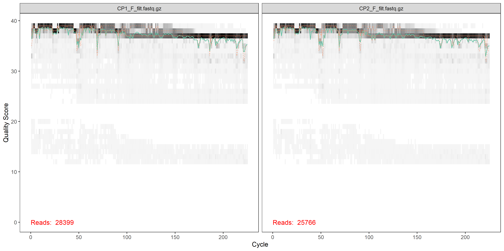

```{r eval=FALSE}
plotQualityProfile(filtRs[1:2])
```

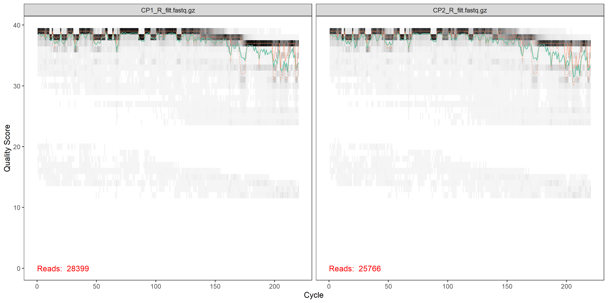

<br/>

### Assess and plot errors
```{r eval=FALSE}
errF <- learnErrors(filtFs, multithread=TRUE)
errR <- learnErrors(filtRs, multithread=TRUE)

plotErrors(errF, nominalQ=TRUE)
```

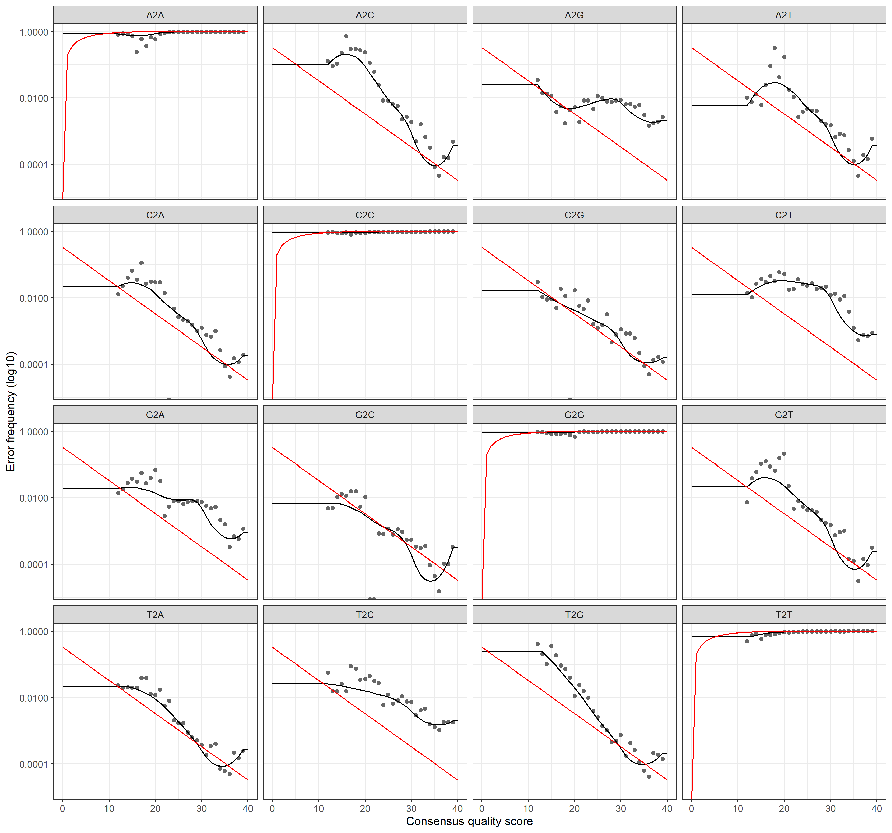

```{r eval=FALSE}
plotErrors(errR, nominalQ=TRUE)
```

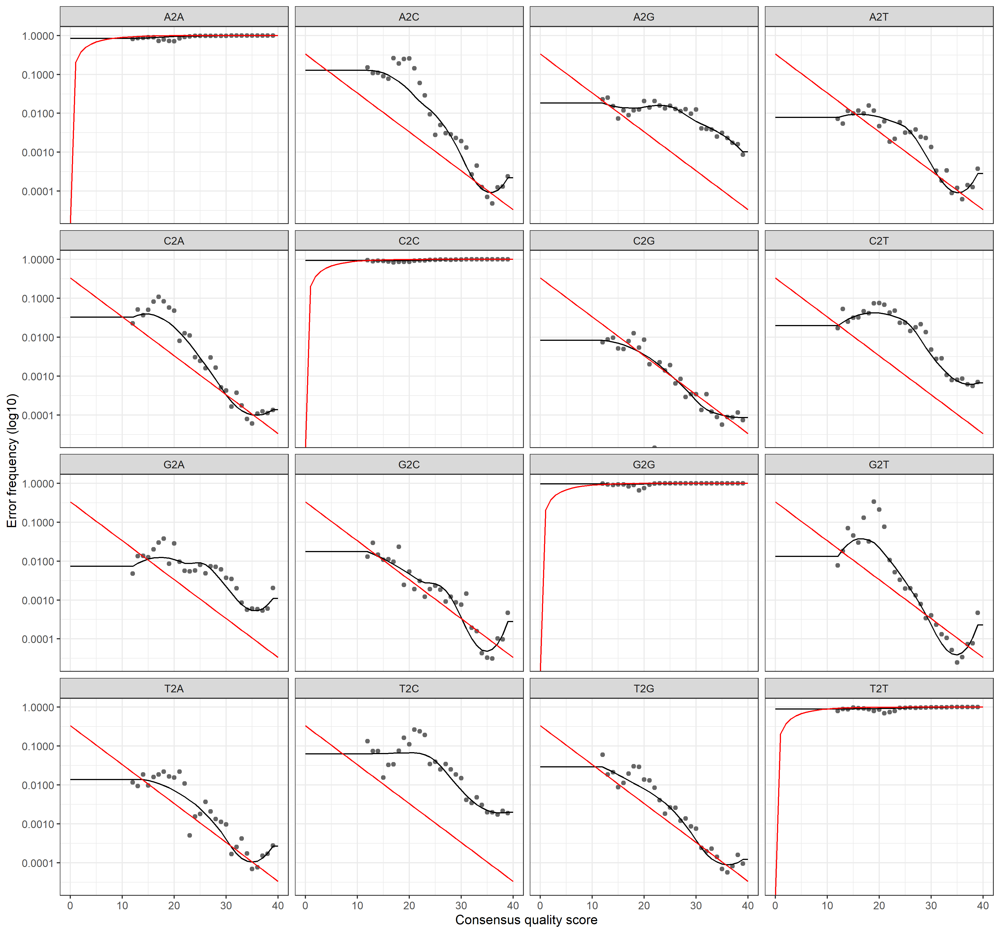

<br/>

### Dereplicate
```{r eval=FALSE}
derepFs <- derepFastq(filtFs, verbose=TRUE)
derepRs <- derepFastq(filtRs, verbose=TRUE)

# Name the derep-class objects by the sample names
names(derepFs) <- sample.names
names(derepRs) <- sample.names
```

<br/>

### Sample inference
```{r eval=FALSE}
dadaFs <- dada(derepFs, err=errF, multithread=TRUE)
dadaRs <- dada(derepRs, err=errR, multithread=TRUE)
```

#### Merge paired reads
```{r eval=FALSE}
mergers <- mergePairs(dadaFs, derepFs, dadaRs, derepRs, verbose=TRUE)
```

<br/>

### Generate sequence table
```{r eval=FALSE}
seqtab <- makeSequenceTable(mergers)

# Inspect distribution of sequence lengths
table(nchar(getSequences(seqtab)))
```

#### Filter expected range
```{r eval=FALSE}
seqtab_subset <- seqtab[,nchar(colnames(seqtab)) %in% seq(426,428)]

# Inspect distribution of sequence lengths
table(nchar(getSequences(seqtab_subset)))
```

#### Remove chimeras
```{r eval=FALSE}
seqtab_subset.nochim <- removeBimeraDenovo(seqtab_subset, 
                                           method="consensus", 
                                           multithread=TRUE, 
                                           verbose=TRUE)

dim(seqtab_subset.nochim)

sum(seqtab_subset.nochim)/sum(seqtab_subset)
```

<br/>

### Track reads through the pipeline 
```{r eval=FALSE}
getN <- function(x) sum(getUniques(x))

track <- cbind(out, 
               sapply(dadaFs, getN), 
               sapply(dadaRs, getN), 
               sapply(mergers, getN), 
               rowSums(seqtab_subset.nochim))

colnames(track) <- c("input", "filtered", "denoisedF", "denoisedR", "merged", "nonchim")
rownames(track) <- sample.names

head(track)
```

```{r echo=F, warning=F, message=F}
library(sparkline)
library(data.table)
library(dplyr)

track <- read.csv("output/16S-track.csv", sep = ";") %>% rename('Group' = X)

bars <- track %>% 
  melt() %>% 
  group_by(Group) %>% 
  summarise(overview = list(value))

track <- track %>% left_join(bars)

reactable(
  track, 
  columns = list(
    overview = colDef(align = 'right',
                      cell = function(values) {
      sparkline(values, type = "bar", chartRangeMin = 0, chartRangeMax = max(track$input), barColor = '#FF934F')
    }),
    Group = colDef(maxWidth = 60)
  ),
  showPageSizeOptions = T, 
  pageSizeOptions = c(10, 20, 30),
  highlight = T, 
  borderless = T
)

```

<br/>

### Assign taxonomy
```{r eval=FALSE}
taxa <- assignTaxonomy(seqtab_subset.nochim, "../silva_nr_v132_train_set.fa.gz", multithread=TRUE)

taxa.print <- taxa # Removing sequence rownames for display only
rownames(taxa.print) <- NULL
head(taxa.print)
```

```{r echo=F, warning=F, message=F}
taxa.print <- read.csv("output/16S-taxa.print.csv", sep = ";", row.names = 1)

reactable(
  taxa.print, 
  columns = list(
    Kingdom = colDef(maxWidth = 80),
    Phylum = colDef(maxWidth = 120),
    Class = colDef(maxWidth = 190),
    Order = colDef(maxWidth = 180),
    Family = colDef(maxWidth = 170)
  ),
  searchable = T, 
  resizable = T,
  showPageSizeOptions = T,
  pageSizeOptions = c(10, 50, 100),
  highlight = T,
  borderless = T
)
```

#### Export results
```{r eval=FALSE}
write.csv2(seqtab.nochim, "../output/16S-asvmat.csv", row.names = T)
write.csv2(taxa, "../output/16S-taxmat.csv", row.names = T)
```

<br/>

***

<!-- Data preparation -->


## **Data preparation**

### Ordering and colors
```{r eval=F}
# Default order for ID and Stage variables
order_id <- c('GS', 'GU', 'LH', 'CP', 'FA', 'WS', 'EA', 'EO', 'EC', 'ES')
order_stage <- c('Larva', 'Pupa', 'Adult', 'Eggs')

# Default color palettes for ID, Stage, and Label variables
cols_stage <- c('Larva' = '#C6AC8F', 'Pupa' = '#5E503F', 'Adult' = '#0A0908', 'Eggs' = '#EAE0D5')

cols_label <- c('Larval haemolymph' = '#C7928F', 'Larval gut unsterile' = '#A35752', 
                'Larval gut sterile' = '#DDBDBB', 'Pupal cell pulp' = '#5E413F', 
                'Female abdomen' = '#4F4740', 'Wash solution' = '#70655C',
                'Eggs cage' = '#F1E0D0', 'Eggs ovarium' = '#E3C1A1', 
                'Eggs oviposition apparatus' = '#D09762', 'Eggs sterile' = '#C78243')

cols_id <- c('LH' = '#C7928F', 'GU' = '#A35752', 'GS' = '#DDBDBB', 'CP' = '#5E413F', 
             'FA' = '#4F4740', 'WS' = '#70655C', 'EC' = '#F1E0D0', 'EO' = '#E3C1A1', 
             'EA' = '#D09762', 'ES' = '#C78243')


```

<br/>

### Load the data
```{r eval=F}
asvmat <- read.csv("../data/dada2-output/16S-asvmat.csv", sep = ";", row.names = 1)
taxmat <- read.csv("../data/dada2-output/16S-taxmat.csv", sep = ";", row.names = 1) 
metmat <- read.csv("../data/metadata.csv", sep = ";")

# Compare and check sequences, assign ASV labels to replace sequences in tables
seq_check <- data.frame(ASV_SEQS = colnames(otumat),
                        TAX_SEQS = rownames(taxmat),
                        ASV = paste0('OTU', seq(1:nrow(taxmat)))) %>% 
  mutate(TEST = ifelse(.$ASV_SEQS == .$TAX_SEQS, 1, 0))

# Sanity check to see if sequences in ASV and taxonomy table match
any(seq_check$TEST == 0) # If any values are 0, seqs do not match
```

<br/>

### Prepare tables
```{r eval=F}
asvmat <- data.frame(t(asvmat)) %>% 
  rownames_to_column('ASV_SEQS') %>% 
  left_join(seq_check %>% select(ASV_SEQS, ASV)) %>% 
  column_to_rownames('ASV') %>% 
  select(-ASV_SEQS)

taxmat <- taxmat %>% 
  rownames_to_column('TAX_SEQS') %>% 
  left_join(seq_check %>% select(TAX_SEQS, ASV)) %>% 
  column_to_rownames('ASV') %>% 
  select(-TAX_SEQS)
```

<br/>

### Create phyloseq object
```{r eval=F}
ps <- phyloseq(
  otu_table(as.matrix(asvmat), taxa_are_rows = T),
  tax_table(as.matrix(taxmat)),
  sample_data(metmat %>% column_to_rownames('SampleID')))
```

#### Explore the phyloseq object
```{r eval=F}


sample_variables(ps) # check available metadata variables
sample_names(ps) # check sample names
sample_data(ps) # check metadata table

# Make sure the variables are plotted in the right order
sample_data(ps)$ID <- factor(sample_data(ps)$ID, levels = order_id)
sample_data(ps)$Stage <- factor(sample_data(ps)$Stage, levels = order_stage)
```

<br/>

### Rarefaction
```{r eval=F}
rarecurve(t(otu_table(ps)), step=50, cex=0.5)
```

<center>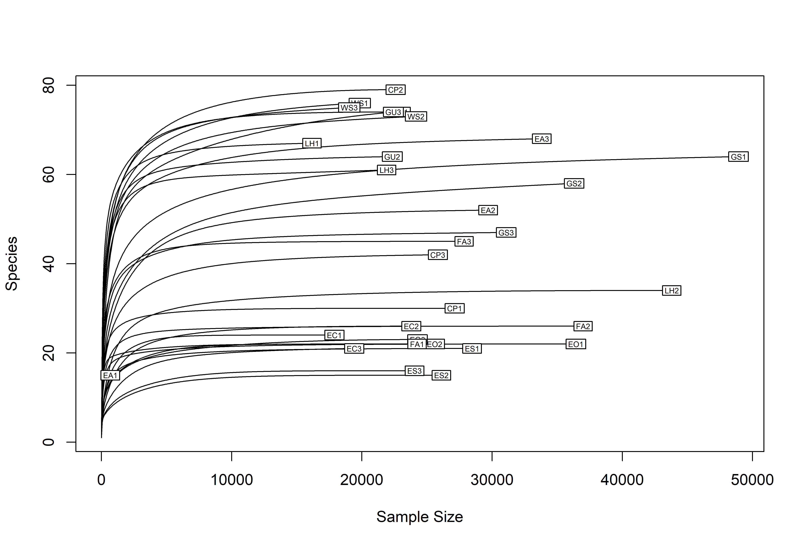</center>

#### Remove outlier and rarefy
```{r eval=F}
# Check smallest sample size
min(sample_sums(ps))

# Remove smallest sample
ps.sub <- subset_samples(ps, sample_names(ps) != 'EA1')

# Check again for smallest sample size and remaining number of samples
min(sample_sums(ps.sub))
nsamples(ps.sub)

# Rarefy abundance data to even depth and plot rarefaction curves
ps.rarefied <- rarefy_even_depth(ps.sub, 
                                 rngseed = 1000, 
                                 sample.size = min(sample_sums(ps.sub)), 
                                 replace = F)

rarecurve(t(otu_table(ps.rarefied)), step=50, cex=0.5)
```

<center>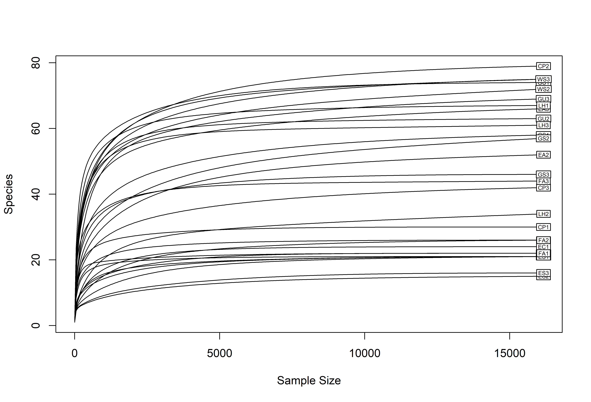</center>

<br/>

#### Before and after filtering and rarefying
Sample  EA1 was removed from the dataset due to significantly lower read numbers. The remaining dataset was rarefied to the smallest sample size, thus, obtaining a dataset with equal sequencing depth.

<br/>

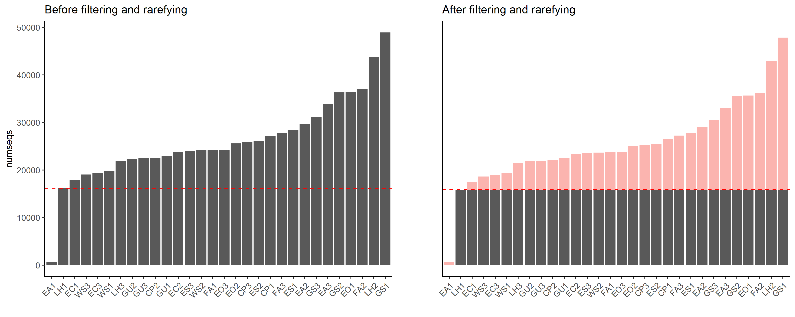

<br/>

#### Convert phyloseq object to ampvis2 object {.tabset}

##### Transformation
```{r eval=F}
amp.rarefied <- phyloseq_to_ampvis2(ps.rarefied)
```

<br/>

***

##### phyloseq_to_ampvis2.R 
Credits to Kasper Skytte Anderson [github.com/KasperSkytte](https://github.com/KasperSkytte) for writing this function

<script src="https://gist.github.com/KasperSkytte/8d0ca4206a66be7ff6d76fc4ab8e66c6.js"></script>

<br/>

***
<!-- Visualization -->

## **Statistics & Visualization**

### General overview {.tabset}

#### Family level community composition
```{r eval=F}
p1 <- ggplot(bac) +
  geom_bar(aes(x = ID, y = Rel_Abundance/3, fill = Family), stat = 'identity', position = 'stack') +
  scale_fill_manual(values = colorRampPalette(brewer.pal(12, 'Set3'))(length(unique(bac$Family))))+
  labs(x = '', y = 'Relative abundance [%]') +
  facet_grid(.~Stage, scales = 'free_x', space = 'free') +
  guides(fill = guide_legend(ncol = 1, title = element_blank())) +
  theme_classic()

p2 <- bac_sub %>% filter(Family == 'Enterobacteriaceae') %>% 
  ggplot() +
  geom_bar(aes(x = ID, y = Rel_Abundance/3, fill = Genus), stat = 'identity', position = 'stack') +
  scale_fill_manual(values = cut_colors[enterobacteriaceae], name = "Enterobacteriaceae") +
  labs(x = '', y = 'Relative abundance [%]') +
  facet_grid(.~Stage, scales = 'free_x', space = 'free_x') +
  theme_classic() +
  theme(legend.position = 'left')

p3 <- bac_sub %>% filter(Family == 'Burkholderiaceae') %>% 
  ggplot() +
  geom_bar(aes(x = ID, y = Rel_Abundance/3, fill = Genus), stat = 'identity', position = 'stack') +
  scale_fill_manual(values = cut_colors[burkholderiaceae], name = "Burkholderiaceae") +
  lims(y = c(0, 100)) +
  facet_grid(.~Stage, scales = 'free_x', space = 'free_x') +
  theme_classic() +
  theme(legend.position = 'right')

ggarrange(
  p1 + 
    theme(legend.position = 'bottom', 
          legend.title = element_text(angle = 90),
          legend.margin = margin(-10, 0, 20, 0)) + 
    guides(fill = guide_legend(nrow = 4, title.hjust = 0.5)), 
  ggarrange(p2 + 
              scale_y_continuous(breaks = c(0, 25, 75, 100), position = 'right', limits = c(0, 100)) +
              theme(axis.text.y.right = element_text(hjust = 0.5, vjust = 6, angle = 270),
                    axis.title.y.right = element_text(size = 9)) +
              guides(fill = guide_legend(label.position = 'left', label.hjust = 1)),
            p3 + 
              theme(axis.text.y = element_blank(),
                    axis.title.y = element_blank()), 
            labels = c('B', 'C'), label.y = 1.05, font.label = list(color = 'grey45', face = 'bold')),
  nrow = 2, heights = c(1.1, 0.8), labels = c('A'),font.label = list(color = 'grey45', face = 'bold'))
```

#### Prepare data
```{r eval=F}
# Rarefy all samples
ps.rarefied.full <- rarefy_even_depth(ps, 
                                      sample.size = min(sample_sums(ps)), 
                                      rngseed = 1000, 
                                      replace = F)

# Construct table containing abundance, taxonomy, and meta information
bac <- data.frame(t(otu_table(ps.rarefied.full))) %>% 
  rownames_to_column('SampleID') %>% 
  melt(variable.name = 'ASV', value.name = 'Abundance') %>% 
  left_join(data.frame(tax_table(ps.rarefied.full)) %>% 
              rownames_to_column('ASV')) %>%
  filter(!is.na(Family)) %>% 
  group_by(SampleID) %>% 
  mutate(Rel_Abundance = Abundance/sum(Abundance)*100) %>% 
  left_join(data.frame(sample_data(ps.rarefied.full)) %>% 
              rownames_to_column('SampleID') %>% 
              select(SampleID, ID, Stage, Label)) %>% 
  mutate(ID = factor(ID, levels = order_id),
         Stage = factor(Stage, levels = c('Larva', 'Pupa', 'Adult', 'Eggs')))

# Subset families of Burkholderiaceae and Enterobacteriaceae
bac_sub <- bac %>% 
  filter(Family %in% c('Burkholderiaceae', 'Enterobacteriaceae')) %>% 
  mutate(Genus = gsub("-", "-\n ", Genus))

cut_colors <- setNames(colorRampPalette(brewer.pal(12, 'Set3'))(length(unique(bac_sub$Genus))), levels(factor(bac_sub$Genus)))

burkholderiaceae <- bac_sub %>% filter(Family == 'Burkholderiaceae') %>% .$Genus %>% unique()
enterobacteriaceae <- bac_sub %>% filter(Family == 'Enterobacteriaceae') %>% .$Genus %>% unique()

```

### {.unlisted .unnumbered}

<center>
    <a href="https://raw.githubusercontent.com/tklammsteiner/eggsurfacemicrobiome/main/docs/output/16S-combined.png">
        </a>
    <p>*click figure to see larger version*</p>
</center>

<br/>

### Alpha diversity
#### Create comprehensive alpha diversity table
```{r eval=F}
alpha <- alpha(ps.rarefied, index = 'all')
```

```{r echo=F, message=F, warning=F}
alpha <- read.csv("output/16S-alpha.csv", sep = ",", row.names = 1) %>% 
  mutate_if(is.numeric, round, 3)

library(htmltools)
htmltools::browsable(
  tagList(
    tags$button(
      tagList("Download as CSV"),
    onclick = "Reactable.downloadDataCSV('alpha', 'alpha-diversity.csv')"
    ),
  reactable(
    alpha,resizable = T, 
    defaultPageSize = 5,
    pagination = T,
    showPageSizeOptions = T,
    compact = T,
    wrap = F,
    elementId = 'alpha'
    )
  )
)
```

#### Prepare data for plotting
```{r eval=F}
# Extract metadata
ps.rarefied.meta <- meta(ps.rarefied)

# Add selected alpha diversity measures to metadata table
ps.rarefied.meta$Shannon <- alpha$diversity_shannon
ps.rarefied.meta$Evenness <- alpha$evenness_pielou

# Set order and grouping for statistics
levels_stage <- levels(as.factor(ps.rarefied.meta$Stage))
pairs_stage <- combn(seq_along(levels_stage), 2, simplify = F, FUN = function(i)levels_stage[i])
```

#### Plot alpha diversity measures and add statics {.tabset}

##### Shannon
```{r eval=F}
# Set shapes for each group of samples
shapes_id <- c('LH' = 16, 'GU' = 17, 'GS' = 18, 'CP' = 16, 'FA' = 16, 'WS' = 17, 'EC' = 16, 'EO' = 17, 'EA' = 18, 'ES' = 15)

# Plot alpha diversity values
shannon_p <- ggplot(ps.rarefied.meta, aes(x = Stage, y = Shannon)) +
  geom_violin(aes(fill = Stage), 
              colour = NA, trim = F, alpha = 0.4) +
  geom_point(aes(colour = ID, shape = ID), 
             size = 4, position = position_jitter(width = 0.15, seed = 12)) +
  geom_boxplot(aes(fill = Stage), 
               colour = 'white', width = 0.2, alpha = 0.25) +
  scale_fill_manual(values = cols_stage) +
  scale_color_manual(values = cols_id) +
  scale_shape_manual(values = shapes_id) +
  labs(x = 'Developmental stage',
       y = 'Shannon index',
       colour = '',
       shape = '') +
  guides(fill = 'none') +
  theme_classic()

# Add statistics
shannon_p <- shannon_p + stat_compare_means(aes(label = ..p.signif..), comparisons = pairs_stage, ref.group = '0.5', method = 'wilcox.test')

# Assign sample groups to developmental stages to subset legend
larva <- c('LH', 'GU', 'GS')
pupa <- c('CP')
adult <- c('FA', 'WS')
eggs <- c('EC', 'EO', 'EA', 'ES')

# Create separate legends for each developmental stage
legend_larva <- get_legend(
  ggplot(ps.rarefied.meta %>% filter(Stage == 'Larva'), 
         aes(x = Stage, y = Shannon)) +
    geom_point(aes(colour = ID, shape = ID), 
               size = 4, position = position_jitter(width = 0.15, seed = 12)) +
    labs(fill = 'Larva', colour = 'Larva', shape = 'Larva') +
    scale_fill_manual(values = cols_stage[larva]) + 
    scale_color_manual(values = cols_id[larva]) + 
    scale_shape_manual(values = shapes_id[larva]))

legend_pupa <- get_legend(
  ggplot(ps.rarefied.meta %>% filter(Stage == 'pupa'), 
         aes(x = Stage, y = Shannon)) +
    geom_point(aes(colour = ID, shape = ID), 
               size = 4, position = position_jitter(width = 0.15, seed = 12)) +
    labs(fill = 'Pupa', colour = 'Pupa', shape = 'Pupa') +
    scale_fill_manual(values = cols_stage[pupa]) + 
    scale_color_manual(values = cols_id[pupa]) + 
    scale_shape_manual(values = shapes_id[pupa]))

legend_adult <- get_legend(
  ggplot(ps.rarefied.meta %>% filter(Stage == 'adult'), 
         aes(x = Stage, y = Shannon)) +
    geom_point(aes(colour = ID, shape = ID), 
               size = 4, position = position_jitter(width = 0.15, seed = 12)) +
    labs(fill = 'Adult', colour = 'Adult', shape = 'Adult') +
    scale_fill_manual(values = cols_stage[adult]) + 
    scale_color_manual(values = cols_id[adult]) + 
    scale_shape_manual(values = shapes_id[adult])) 

legend_eggs <- get_legend(
  ggplot(ps.rarefied.meta %>% filter(Stage == 'eggs'), 
         aes(x = Stage, y = Shannon)) +
    geom_point(aes(colour = ID, shape = ID), 
               size = 4, position = position_jitter(width = 0.15, seed = 12)) +
    labs(fill = 'Eggs', colour = 'Eggs', shape = 'Eggs') +
    scale_fill_manual(values = cols_stage[eggs]) + 
    scale_color_manual(values = cols_id[eggs]) + 
    scale_shape_manual(values = shapes_id[eggs]))

# Arrange legends
legends <- ggarrange(legend_larva, legend_pupa, legend_adult, legend_eggs, nrow = 4, heights = c(0.4, 0.2, 0.3, 0.5))

# Combine the alpha diversity plot with its legends
shannon_p <- ggarrange(shannon_p + theme(legend.position = 'none'), ggarrange(legends,nrow = 2, heights = c(0.6, 0.4)), ncol = 2, widths = c(1.8, 0.3))

shannon_p
```

<center>
    <a href="https://raw.githubusercontent.com/tklammsteiner/eggsurfacemicrobiome/main/docs/output/16S-shannon.png">
        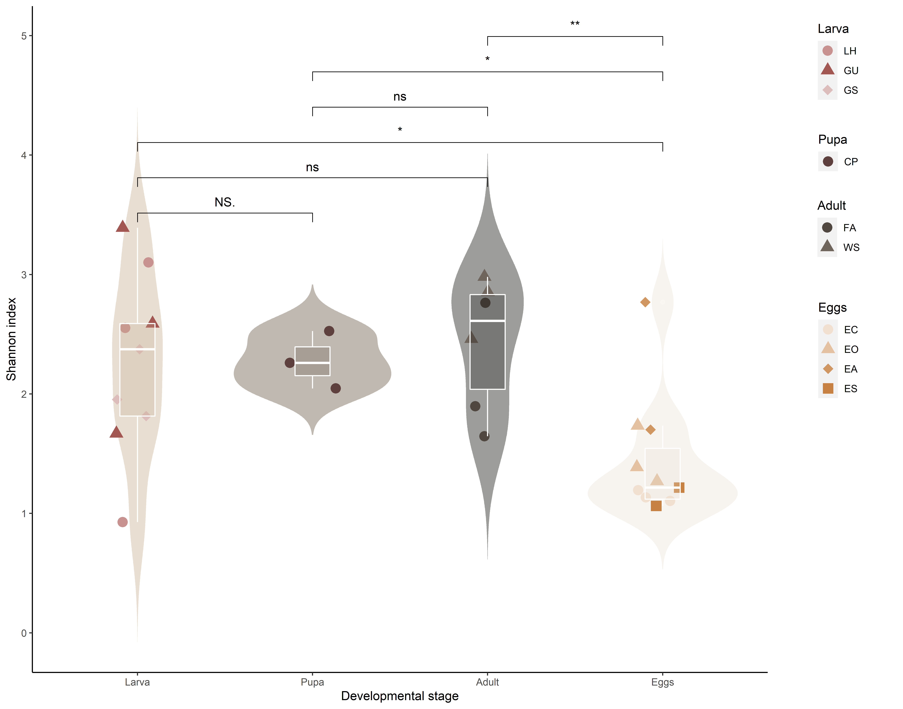</a>
    <p>*click figure to see larger version*</p>
</center>

<br/>

##### Pielou's evenness
```{r eval=F}
pielou_p <- ggplot(ps.rarefied.meta, aes(x = Stage, y = Evenness)) +
  geom_violin(aes(fill = Stage), colour = NA, trim = F, alpha = 0.4) +
  geom_point(aes(colour = ID, shape = Tissue), size = 4, position = position_jitter(width = 0.15, seed = 12)) +
  geom_boxplot(aes(fill = Stage), colour = 'white', width = 0.2, alpha = 0.25) +
  scale_fill_manual(values = cols_stage) +
  scale_color_manual(values = cols_id) +
  labs(x = 'Developmental stage',
       y = 'Shannon index',
       colour = '',
       shape = '') +
  guides(fill = 'none') +
  theme_classic()

pielou_p <- pielou_p + stat_compare_means(aes(label = ..p.signif..), comparisons = pairs_stage, ref.group = '0.5', method = 'wilcox.test')

pielou_p
```

<center>
    <a href="https://raw.githubusercontent.com/tklammsteiner/eggsurfacemicrobiome/main/docs/output/16S-pielou.png">
        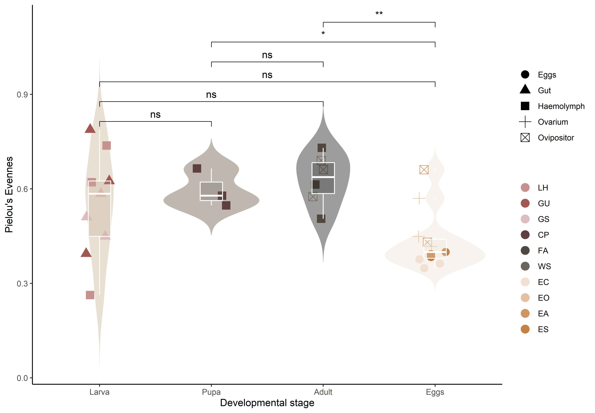</a>
    <p>*click figure to see larger version*</p>
</center>

<br/>

##### Rank abundance
```{r eval=F}
amp_rankabundance(amp.rarefied, group_by = 'Stage', showSD = TRUE, log10_x = TRUE) +
  scale_colour_manual(values = cols_stage) +
  scale_fill_manual(values = cols_stage)
```

<center>
    <a href="https://raw.githubusercontent.com/tklammsteiner/eggsurfacemicrobiome/main/docs/output/16S-rankabund.png">
        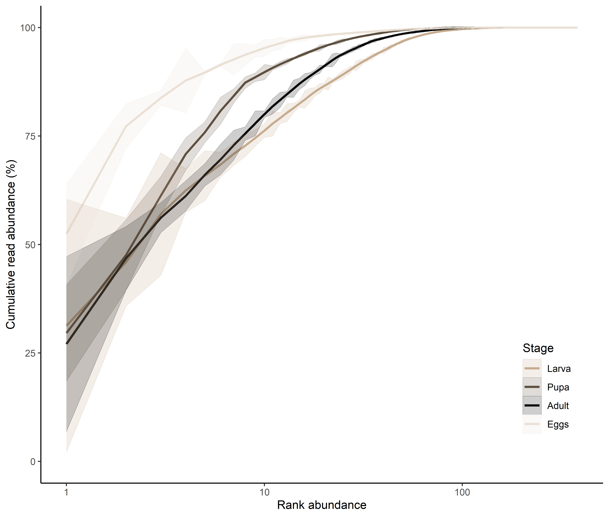</a>
    <p>*click figure to see larger version*</p>
</center>

<br/>

### Venn diagrams {.tabset}

#### Life cycle 
```{r eval=F}
# Group samples based on developmental stage

venn_p1 <- ps_venn(ps.rarefied, 
                   group = 'Stage',
                   fill = cols_stage,
                   colour = 'white',
                   edges = F,
                   alpha = 0.5)
venn_p1
```

<center>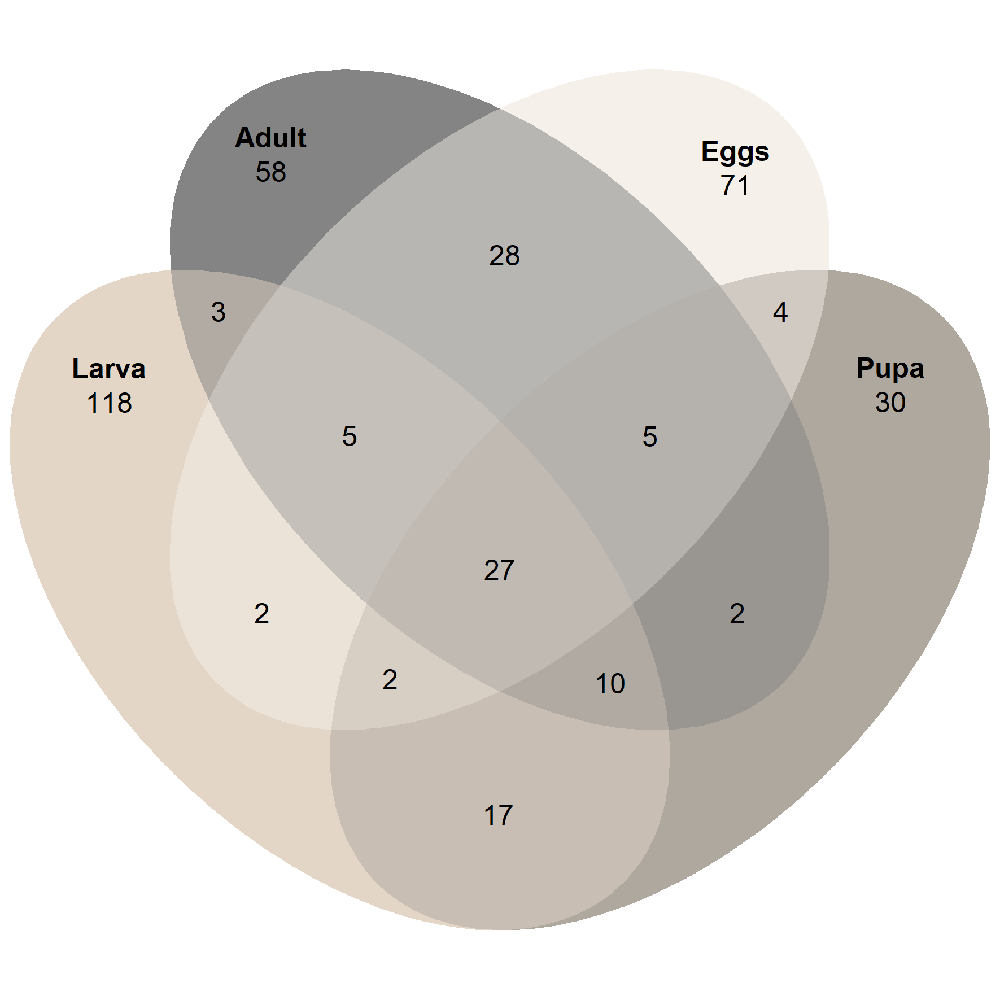</center>

<br/>

#### Eggs
```{r eval=F}
ps_egg <- subset_samples(ps.rarefied, Stage == 'Eggs')

venn_p2 <- ps_venn(ps_egg, 
                   group = 'ID',
                   fill = c('EA' = '#D09762', 'EO' = '#E3C1A1', 'EC' = '#F1E0D0', 'ES' = '#C78243'),
                   colour = 'white',
                   edges = F,
                   alpha = 0.5)
venn_p2
```

<center>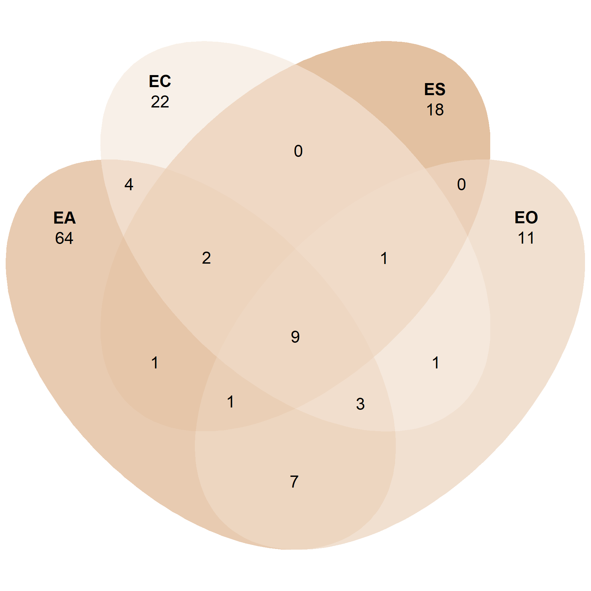</center>

<br/>

#### Larvae
```{r eval=F}
ps_lar <- subset_samples(ps.rarefied, Stage == 'Larva')

venn_p3 <- ps_venn(ps_lar, 
                   group = 'ID',
                   fill = c('GS' = '#DDBDBB', 'GU' = '#A35752', 'LH' = '#C7928F'),
                   colour = 'white',
                   edges = F,
                   alpha = 0.5)
venn_p3
```

<center>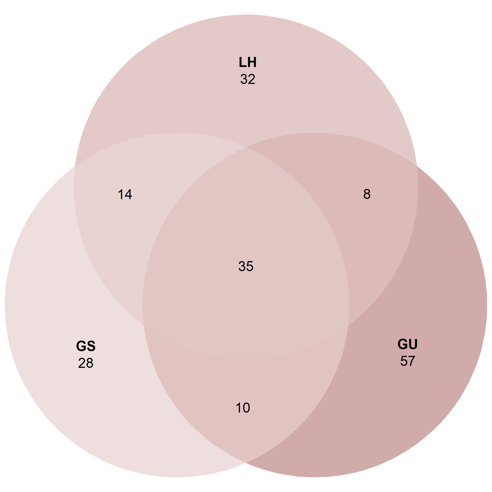</center>

<br/>

#### Adults
```{r eval=F}
ps_adu <- subset_samples(ps.rarefied, Stage == 'Adult')

venn_p4 <- ps_venn(ps_adu, 
                   group = 'ID',
                   fill = c('FA' = '#4F4740', 'WS' = '#70655C'),
                   colour = 'white',
                   edges = F,
                   alpha = 0.5)
venn_p4
```

<center>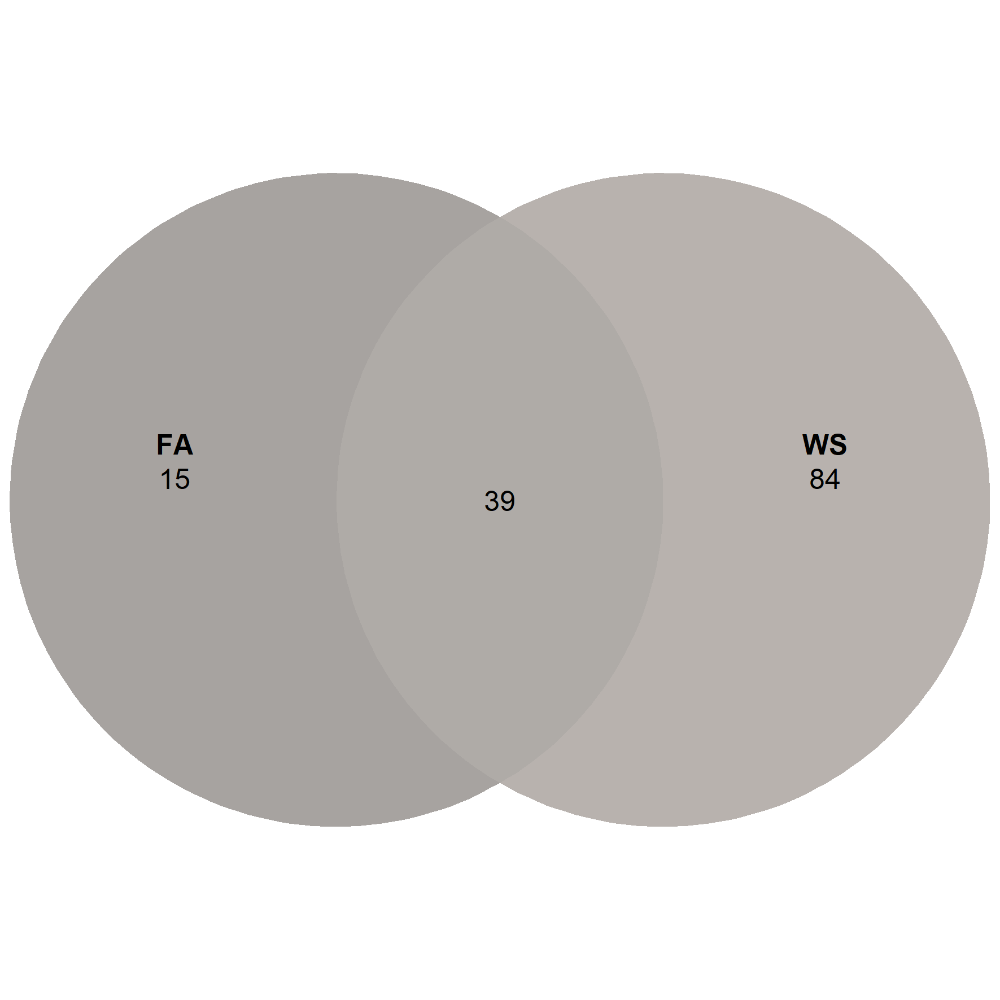</center>

<br/>

#### Eggs+Adults
```{r eval=F}
ps_adu_egg <- subset_samples(ps.rarefied, ID %in% c('FA', 'WS', 'EA', 'EO'))

venn_p5 <- ps_venn(ps_adu_egg, 
                   group = 'ID',
                   fill = c('FA' = '#4F4740', 'WS' = '#70655C', 'EA' = '#D09762', 'EO' = '#E3C1A1'),
                   colour = 'white',
                   edges = F,
                   alpha = 0.5)
venn_p5
```

<center>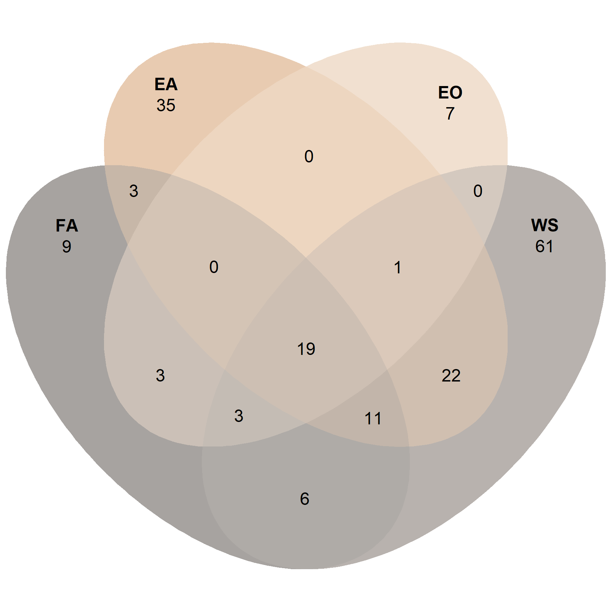</center>

#### Plots arranged

<center>
    <a href="https://raw.githubusercontent.com/tklammsteiner/eggsurfacemicrobiome/main/docs/output/16S-venn-arranged.png">
        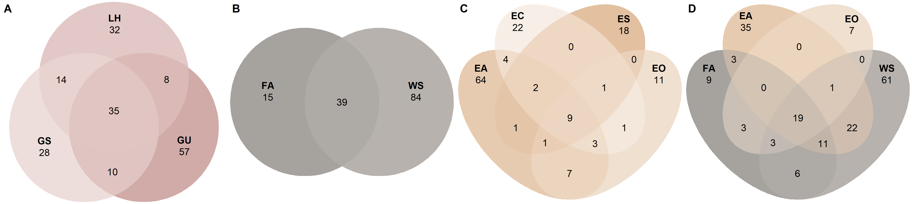</a>
    <p>*click figure to see larger version*</p>
</center>


<br/>

### Heatmap

#### Plot heatmap
```{r eval=F}
amp_heatmap(
  amp.rarefied,
  group_by = 'SampleID',
  facet_by = 'Stage', 
  tax_aggregate = 'Genus',
  tax_add = 'Phylum',
  tax_show = 25, 
  normalise = T, 
  showRemainingTaxa = T, 
  plot_values_size = 3, 
  color_vector = c('white', '#A2708A'),
  plot_colorscale = 'sqrt',
  plot_values = F) +
  theme(axis.text.x = element_text(angle = 45, size = 8, vjust = 1),
        axis.text.y = element_text(size = 8),
        legend.position='right')
```

<br/>

<center>
    <a href="https://raw.githubusercontent.com/tklammsteiner/eggsurfacemicrobiome/main/docs/output/16S-heatmap_1.png">
        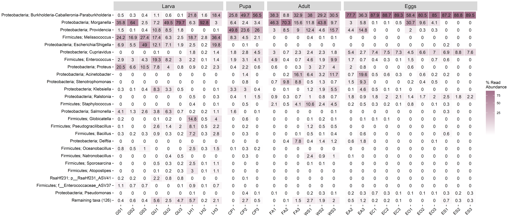</a>
    <p>*click figure to see larger version*</p>
</center>

<br/>

### Ordination

#### Canonical Correspondence Analysis {.tabset}
```{r eval=F}
ordinationresult <- amp_ordinate(
  amp.rarefied, 
  type = 'CCA',
  constrain = 'ID',
  transform = 'Hellinger',
  sample_color_by = 'Stage',
  sample_colorframe = TRUE, 
  sample_colorframe_label_size = 4, 
  sample_colorframe_label = 'Stage', 
  sample_label_by = 'ID', 
  sample_label_size = 3.5,
  repel_labels = T,
  detailed_output = T)
```

##### CCA 
```{r eval=F}
ordinationresult$plot +
  scale_fill_manual(values = cols_stage) +
  scale_colour_manual(values = cols_stage) +
  labs(fill = '', colour = '') +
  theme_classic() +
  theme(legend.position = 'none')
```

<center>
    <a href="https://raw.githubusercontent.com/tklammsteiner/eggsurfacemicrobiome/main/docs/output/16S-ordination_1.png">
      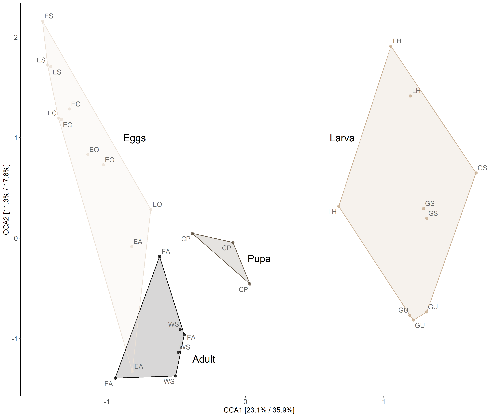</a>
    <p>*click figure to see larger version*</p>
</center>

<br/>

##### Screeplot
```{r eval=F}
ordinationresult$screeplot
```

<center>
    <a href="https://raw.githubusercontent.com/tklammsteiner/eggsurfacemicrobiome/main/docs/output/16S-screeplot_1.png">
      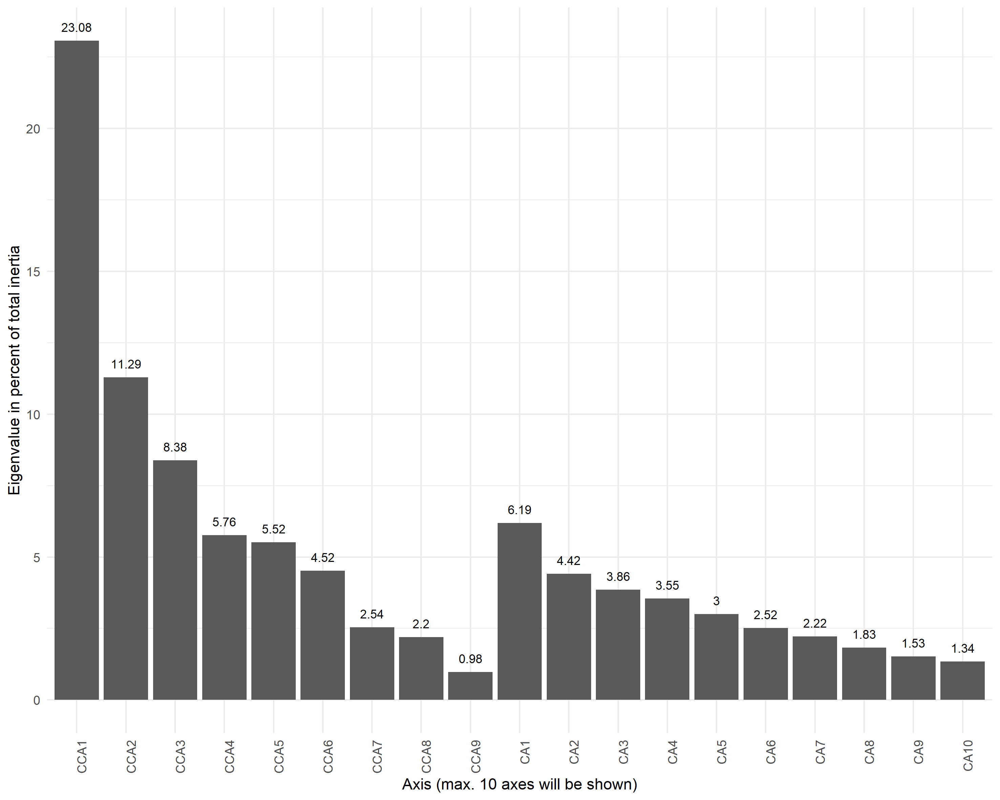</a>
    <p>*click figure to see larger version*</p>
</center>

<br/>

### Permanova {.tabset}
```{r eval=F}
# Prepare data
abund_tab <- data.frame(t(otu_table(ps.rarefied)))
group_tab <- data.frame(sample_data(ps.rarefied)) %>% rownames_to_column('SampleID')
```

#### Developmental stage 
```{r eval = F}
set.seed(123)
adonis_stage <- adonis(abund_tab ~ Stage, data = group_tab, permutations = 1000, method = 'bray')
adonis_stage
```

```{r echo=F, warning=F, message=F}
adonis_stage <- readRDS("output/16S-adonis-stage.txt")
adonis_stage$aov.tab
```

<br/>

#### Tissue
```{r eval=F}
set.seed(123)
adonis_tissue <- adonis(abund_tab ~ Tissue, data = group_tab, permutations = 1000, method = 'bray')
adonis_tissue
```

```{r echo=F, warning=F, message=F}
adonis_tissue <- readRDS("output/16S-adonis-tissue.txt")
adonis_tissue$aov.tab
```

<br/>

### Pairwise Permanova {.tabset}
#### Developmental stage
```{r eval=F}
set.seed(123)
ppermanova_stage <- pairwise.perm.manova(vegdist(abund_tab, method = 'bray'), group_tab$Stage, nperm = 1000, p.method = 'bonferroni')
ppermanova_stage
```

```{r echo=F, warning=F, message=F}
ppermanova_stage <- readRDS("output/16S-ppermanova-stage.txt")
ppermanova_stage
```


<br/>

#### Tissue
```{r eval=F}
set.seed(123)
ppermanova_tissue <- pairwise.perm.manova(vegdist(abund_tab, method = 'bray'), grouping$Tissue, nperm = 1000, p.method = 'bonferroni')
ppermanova_tissue
```

```{r echo=F, warning=F, message=F}
ppermanova_tissue <- readRDS("output/16S-ppermanova-tissue.txt")
ppermanova_tissue
```

<br/>

### LefSe
```{r eval=F}
lefse <- run_lefse(ps.rarefied,
                   group = 'Stage',
                   taxa_rank = 'Genus')
```

#### Plot
```{r eval=F}
plot_ef_bar(x) +
  scale_fill_manual(values = cols_stage) +
  theme_classic() +
  theme(legend.title = element_blank(),
        legend.position = c(0.8, 0.1))
```

<center>
    <a href="https://raw.githubusercontent.com/tklammsteiner/eggsurfacemicrobiome/main/docs/output/16S-lefse.png">
      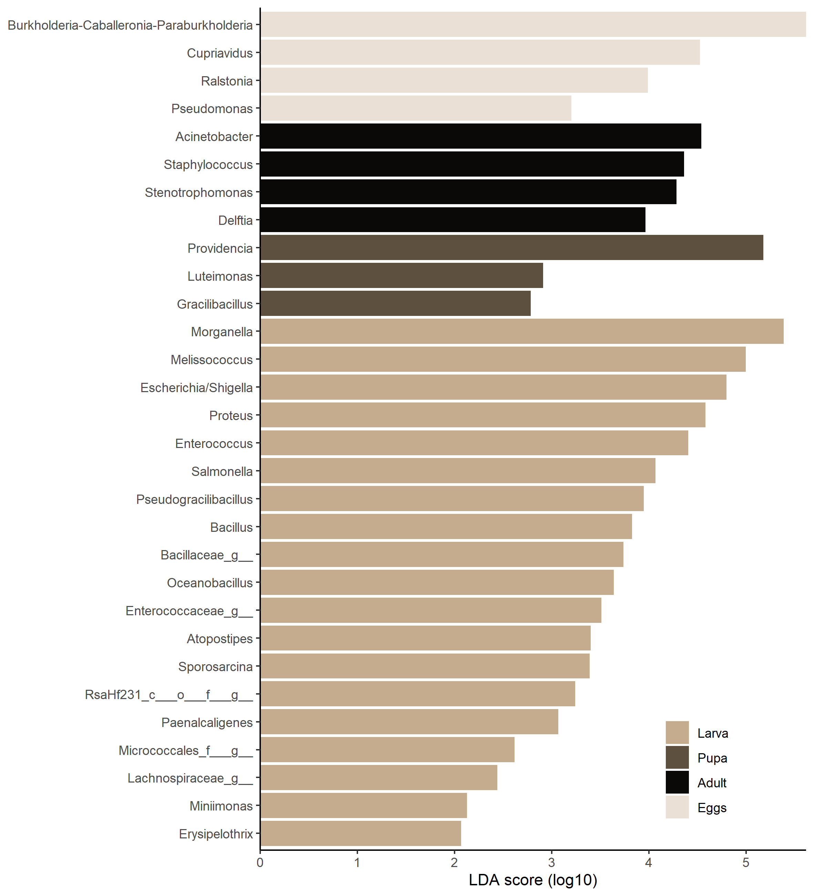</a>
    <p>*click figure to see larger version*</p>
</center>

<br/>

### Network
```{r eval=F}
library(ggrepel)

set.seed(100)

ig <- make_network(ps.rarefied, max.dist = 0.5, distance = 'bray')

plot_network(ig, ps.rarefied, color = 'Stage', point_size = 4, type = 'samples', label = NA) +
  geom_text_repel(aes(label = value), size = 3.5, box.padding = 0.5) +
  scale_colour_manual(values = cols_stage) +
  theme(legend.position = c(0.8, 0.2))
```

<center>
    <a href="https://raw.githubusercontent.com/tklammsteiner/eggsurfacemicrobiome/main/docs/output/16S-network.png">
      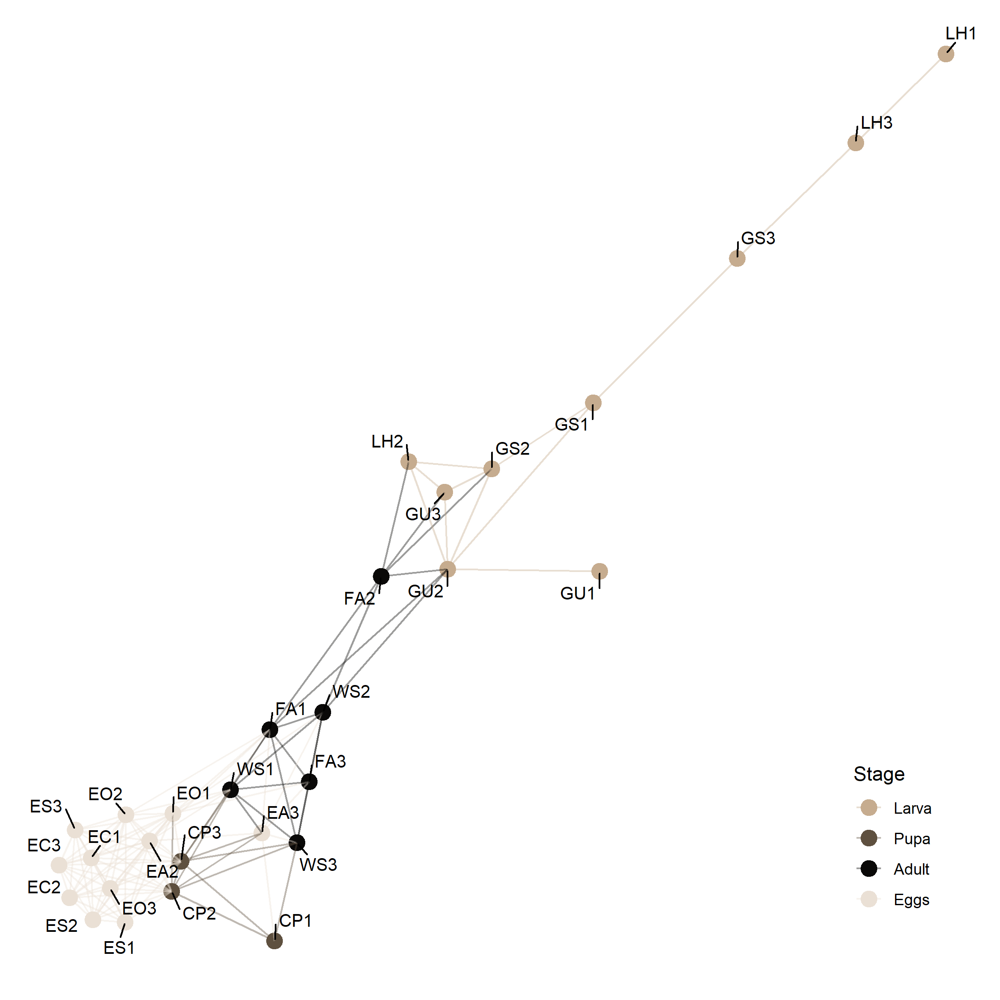</a>
    <p>*click figure to see larger version*</p>
</center>

***