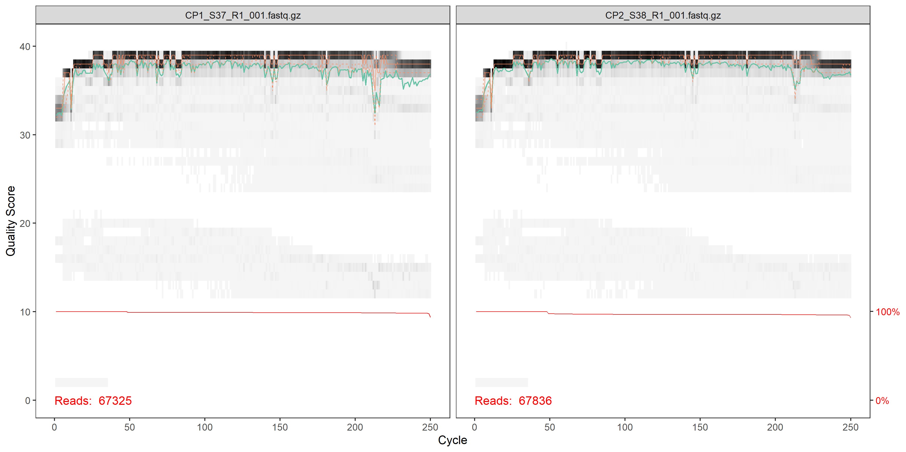
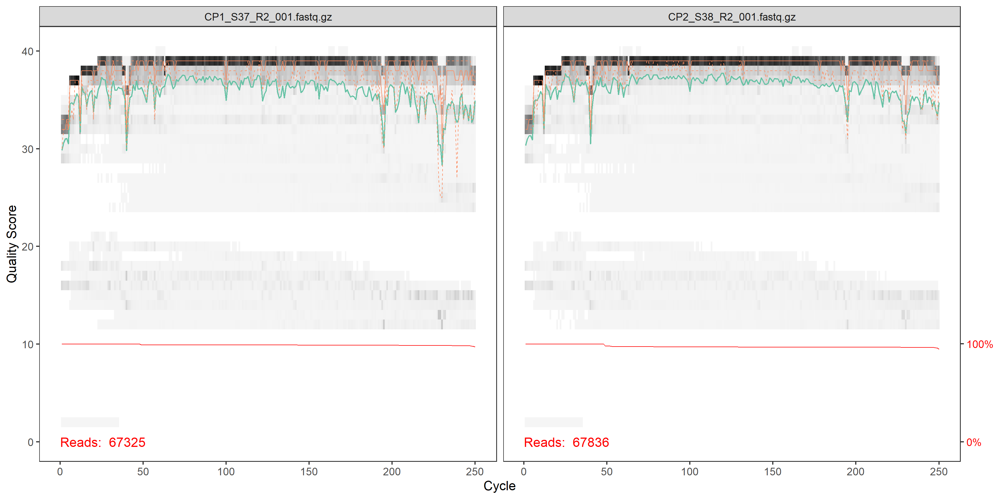
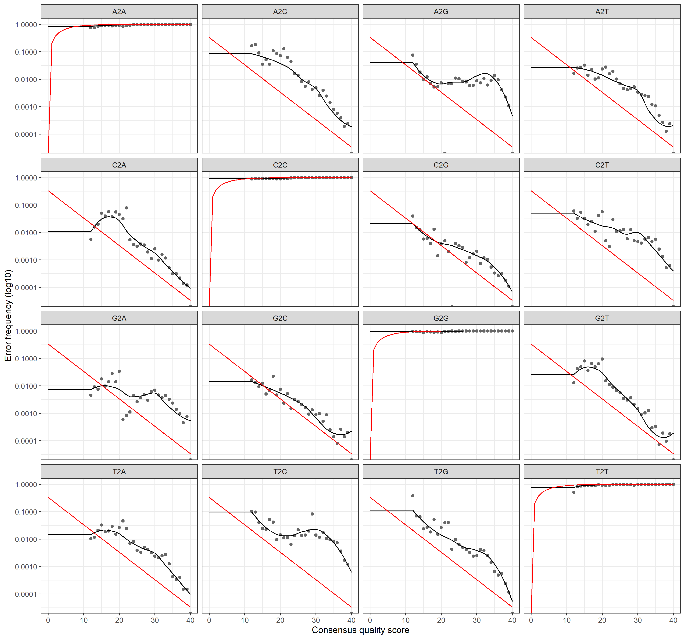
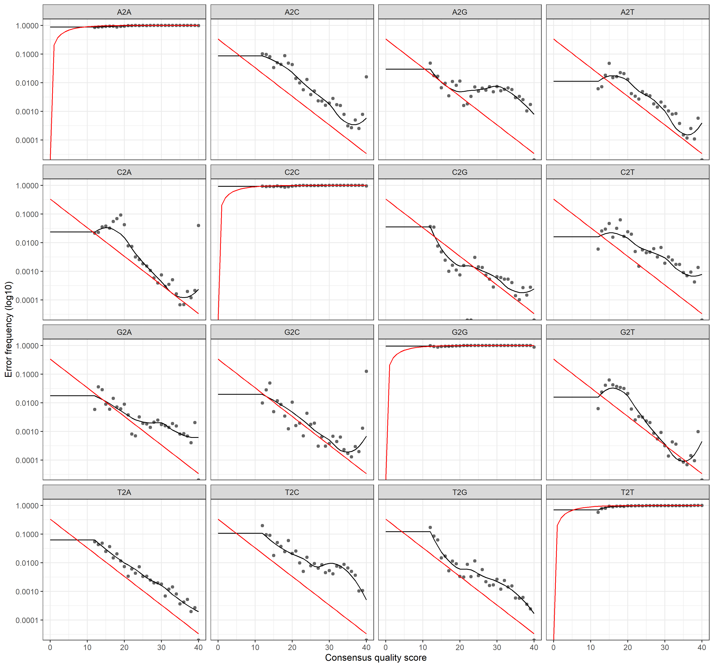

```{r setup, include=FALSE}
knitr::opts_chunk$set(echo = TRUE)
```

<style>
  body {text-align: justify}
</style>

## **Sequence processing**

### Prepare environment
#### Load packages
```{r packagesITS, eval=F, warning=F, message=F}
library(dada2); packageVersion("dada2")
library(tidyverse); packageVersion("tidyverse")
library(reshape2); packageVersion("reshape2")
library(ShortRead); packageVersion("ShortRead")
library(Biostrings); packageVersion("Biostrings")
```

#### Set path and gather samples
```{r eval=F}
path <- "...set path to your read files..."

list.files(path)

fnFs <- sort(list.files(path, pattern = "R1_001.fastq.gz", full.names = TRUE))
fnRs <- sort(list.files(path, pattern = "R2_001.fastq.gz", full.names = TRUE))
```

<br/>

### Quality profiles of raw reads
```{r eval=F}
plotQualityProfile(fnFs[1:2])
```



```{r eval=F}
plotQualityProfile(fnRs[1:2])
```



<br/>

### Primer removal
#### Identify primers
```{r eval=F}
FWD <- "GCATCGATGAAGAACGCAGC"
REV <- "TCCTCCGCTTATTGATATGC" 

allOrients <- function(primer) {
  # Create all orientations of the input sequence
  require(Biostrings)
  dna <- DNAString(primer)  # The Biostrings works w/ DNAString objects rather than character vectors
  orients <- c(Forward = dna, Complement = complement(dna), Reverse = reverse(dna), 
               RevComp = reverseComplement(dna))
  return(sapply(orients, toString))  # Convert back to character vector
}

FWD.orients <- allOrients(FWD)
REV.orients <- allOrients(REV)
FWD.orients

fnFs.filtN <- file.path(path, "filtN", basename(fnFs)) # Put N-filterd files in filtN/ subdirectory
fnRs.filtN <- file.path(path, "filtN", basename(fnRs))

filterAndTrim(fnFs, fnFs.filtN, fnRs, fnRs.filtN, maxN = 0, multithread = FALSE)

primerHits <- function(primer, fn) {
  # Counts number of reads in which the primer is found
  nhits <- vcountPattern(primer, sread(readFastq(fn)), fixed = FALSE)
  return(sum(nhits > 0))
}

rbind(FWD.ForwardReads = sapply(FWD.orients, primerHits, fn = fnFs.filtN[[1]]), 
                  FWD.ReverseReads = sapply(FWD.orients, primerHits, fn = fnRs.filtN[[1]]), 
                  REV.ForwardReads = sapply(REV.orients, primerHits, fn = fnFs.filtN[[1]]), 
                  REV.ReverseReads = sapply(REV.orients, primerHits, fn = fnRs.filtN[[1]]))

```

```{r echo=F, message=F, warning=F}
primer <- read.csv("output/ITS-primer.csv", sep = ";", row.names = 1)

reactable(
  primer
)
```

<br/>

#### Remove primers
```{r eval=F}
cutadapt <- ".../cutadapt_v.3.4/cutadapt-3.4.exe" # CHANGE ME to the cutadapt path on your machine
system2(cutadapt, args = "--version") # Run shell commands from R

path.cut <- file.path(".../cutadapt")

if(!dir.exists(path.cut)) dir.create(path.cut)

fnFs.cut <- file.path(path.cut, basename(fnFs))
fnRs.cut <- file.path(path.cut, basename(fnRs))

FWD.RC <- dada2:::rc(FWD)
REV.RC <- dada2:::rc(REV)

# Trim FWD and the reverse-complement of REV off of R1 (forward reads)
R1.flags <- paste("-g", FWD, "-a", REV.RC) 

# Trim REV and the reverse-complement of FWD off of R2 (reverse reads)
R2.flags <- paste("-G", REV, "-A", FWD.RC) 

# Run Cutadapt
for(i in seq_along(fnFs)) {
  system2(cutadapt, args = c(R1.flags, R2.flags, "-n", 2, # -n 2 required to remove FWD and REV from reads
                             "-o", fnFs.cut[i], "-p", fnRs.cut[i], # output files
                             fnFs.filtN[i], fnRs.filtN[i])) # input files
}

rbind(FWD.ForwardReads = sapply(FWD.orients, primerHits, fn = fnFs.cut[[1]]), 
                           FWD.ReverseReads = sapply(FWD.orients, primerHits, fn = fnRs.cut[[1]]), 
                           REV.ForwardReads = sapply(REV.orients, primerHits, fn = fnFs.cut[[1]]), 
                           REV.ReverseReads = sapply(REV.orients, primerHits, fn = fnRs.cut[[1]]))

```

```{r echo=F, warning=F, message=F}
primer_removed <- read.csv("output/ITS-primer-removed.csv", sep = ";", row.names = 1)

reactable(
  primer_removed
)
```

```{r eval=F}
# Forward and reverse fastq filenames have the format:
cutFs <- sort(list.files(path.cut, pattern = "R1_001.fastq.gz", full.names = TRUE))
cutRs <- sort(list.files(path.cut, pattern = "R2_001.fastq.gz", full.names = TRUE))

# Extract sample names, assuming filenames have format:
get.sample.name <- function(fname) strsplit(basename(fname), "_")[[1]][1]
sample.names <- unname(sapply(cutFs, get.sample.name))
```

<br/>

### Filter and trim
```{r eval=F}
filtFs <- file.path(path.cut, "filtered", basename(cutFs))
filtRs <- file.path(path.cut, "filtered", basename(cutRs))

out <- filterAndTrim(cutFs, filtFs, cutRs, filtRs, maxN = 0, maxEE = c(2, 2), 
                     truncQ = 2, minLen = 50, rm.phix = TRUE, compress = TRUE, multithread = FALSE)
out
```

```{r echo=F, warning=F, message=F}
out <- read.csv("output/ITS-out.csv", sep = ";", row.names = 1)

reactable(
  out,
  showPageSizeOptions = T, 
  pageSizeOptions = c(10, 20, 30),
  highlight = T, 
  borderless = T
)
```

<br/>

### Learn the error rates
```{r eval=F}
errF <- learnErrors(filtFs, multithread = TRUE)
errR <- learnErrors(filtRs, multithread = TRUE)

plotErrors(errF, nominalQ = TRUE)
```



```{r eval=F}
plotErrors(errR, nominalQ = TRUE)
```



<br/>

### Dereplicate identical reads
```{r eval=F}
derepFs <- derepFastq(filtFs, verbose = TRUE)
derepRs <- derepFastq(filtRs, verbose = TRUE)

# Name the derep-class objects by the sample names
names(derepFs) <- sample.names
names(derepRs) <- sample.names
```

<br/>

### Sample inference
```{r eval=F}
dadaFs <- dada(derepFs, err = errF, multithread = TRUE)
dadaRs <- dada(derepRs, err = errR, multithread = TRUE)
```

#### Merge paired reads
```{r eval=F}
mergers <- mergePairs(dadaFs, derepFs, dadaRs, derepRs, verbose=TRUE)
```

<br/>

### Generate sequence table
```{r eval=F}
seqtab <- makeSequenceTable(mergers)

seqtab
```

*Sequences were replaced by consecutive ASV labels for clarity*
```{r echo=F, warning=F, message=F}
seqtab <- read.csv("output/ITS-seqtab.csv", sep = ";", row.names = 1) %>% 
  setNames(paste0("ASV", 1:ncol(.)))

reactable(
  seqtab,
  showPageSizeOptions = T, 
  pageSizeOptions = c(10, 20, 30),
  highlight = T, 
  borderless = T
)
```

#### Remove chimeras
```{r eval=F}
seqtab.nochim <- removeBimeraDenovo(seqtab, method="consensus", multithread=TRUE, verbose=TRUE)
```

*Sequences were replaced by consecutive ASV labels for clarity*
```{r echo=F, warning=F, message=F}
seqtab.nochim <- read.csv("output/ITS-seqtab.nochim.csv", sep = ";", row.names = 1) %>% 
  setNames(paste0("ASV", 1:ncol(.)))

reactable(
  seqtab.nochim,
  showPageSizeOptions = T, 
  pageSizeOptions = c(10, 20, 30),
  highlight = T, 
  borderless = T
)
```

<br/>

### Track reads through the pipeline
```{r eval=F}
getN <- function(x) sum(getUniques(x))
track <- cbind(out, sapply(dadaFs, getN), sapply(dadaRs, getN), sapply(mergers, 
                                                                       getN), rowSums(seqtab.nochim))
# If processing a single sample, remove the sapply calls: e.g. replace
# sapply(dadaFs, getN) with getN(dadaFs)
colnames(track) <- c("input", "filtered", "denoisedF", "denoisedR", "merged", 
                     "nonchim")
rownames(track) <- sample.names
track
```

```{r echo=F, warning=F, message=F}
track <- read.csv("output/ITS-track.csv", sep = ";") %>% rename('Group' = X)

bars <- track %>% 
  melt() %>% 
  group_by(Group) %>% 
  summarise(overview = list(value))

track <- track %>% left_join(bars)

reactable(
  track, 
  columns = list(
    overview = colDef(align = 'right',
                      cell = function(values) {
      sparkline(values, type = "bar", chartRangeMin = 0, chartRangeMax = max(track$input), barColor = '#CE6A85')
    }),
    Group = colDef(maxWidth = 60)
  ),
  showPageSizeOptions = T, 
  pageSizeOptions = c(10, 20, 30),
  highlight = T, 
  borderless = T
)
```

<br/>

### Assign taxonomy
```{r eval=F}
assignTaxonomy(seqtab.nochim, ".../sh_general_release_dynamic_s_10.05.2021.fasta", multithread = TRUE, tryRC = TRUE)

taxa.print <- taxa  # Removing sequence rownames for display only
rownames(taxa.print) <- NULL
taxa.print
```

```{r echo=F, warning=F, message=F}
taxa.print <- read.csv("output/ITS-taxa.print.csv", sep = ";", row.names = 1)

reactable(
  taxa.print,
  columns = list(
    Kingdom = colDef(maxWidth = 80),
    Phylum = colDef(maxWidth = 120),
    Class = colDef(maxWidth = 190),
    Order = colDef(maxWidth = 180),
    Family = colDef(maxWidth = 170)
  ),
  searchable = T, 
  resizable = T,
  showPageSizeOptions = T,
  pageSizeOptions = c(10, 50, 100),
  highlight = T,
  borderless = T
)
```

#### Export results
```{r eval=FALSE}
write.csv2(seqtab.nochim, "../output/ITS-asvmat.csv", row.names = T)
write.csv2(taxa, "../output/ITSS-taxmat.csv", row.names = T)
```

<br/>  

***

## **Data preparation**


<br/>

***

## **Statistics & Visualization**


<br/>

***
