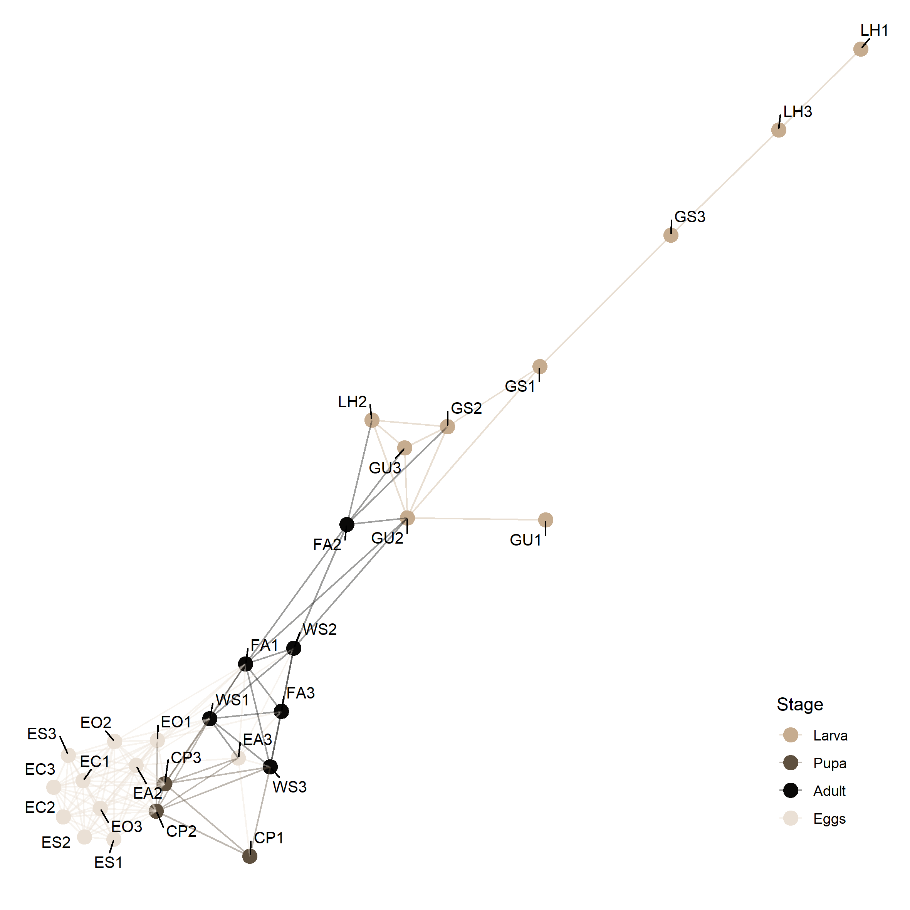

```{r setup, include=FALSE}
knitr::opts_chunk$set(echo = TRUE)
```

<style>
  p.comment {
  background-color: #FCF9EE;
  padding: 10px;
  margin-left: 25px;
  margin-right: 50px;
  border-radius: 5px;
  }
</style>

<br/>

**Abbreviations:**  
<ul>
  <li>Larvae: **LH** = Larval haemolymph, **GS** = Guts from larvae raised on sterile diet, **GU** = Guts from larvae raised on non-sterilized diet</li>  
  <li>Pupae: **CP** = Pupal cell pulp</li>
  <li>Adults: **FA** = Female abdomen, **WS** = Wash solution from ovipositor</li>  
  <li>Eggs: **EA** = Eggs collected from ovipositor, **EC** = Eggs harvested from cage, **EO** = Eggs dissected from ovarium,  **ES** = Surface-sterilized eggs</li>  
  

<br/><br/>

<center>

<a href="https://raw.githubusercontent.com/tklammsteiner/eggsurfacemicrobiome/main/docs/output/16S-combined.png">
    
</a>
        
<figcaption align = "center">
    <b>Fig. 1</b> - General bacterial community composition observed in samples at <b>(A)</b> family level. Panels <b>(B)</b> and <b>(C)</b> show subsets of the data for the families of Enterobacteriaceae and Burkholderiaceae at genus level.  
</figcaption>
    
<p>*click figure to see larger version*</p>
  
  
<br/><br/><br/><br/>

<center>

<a href="https://raw.githubusercontent.com/tklammsteiner/eggsurfacemicrobiome/main/docs/output/16S-arr_1.png">
    
</a>
        
<figcaption align = "center">
    <b>Fig. 2</b> - <b>(A)</b> Rank abundance curves of samples grouped according to the fly's developmental stage. The lines indicate the cumulative read abundance (%) while the semi-transparent ribbons show the standard deviation within each group. <b>(B)</b> Shannon index calculated for each sample (data points), grouped by the black soldier fly's developmental stage (violins). The shape of the data points mark the type of sample material and the colours indicate their origin.
</figcaption>
    
<p>*click figure to see larger version*</p>
  
  
<br/><br/><br/><br/>


<a href="https://raw.githubusercontent.com/tklammsteiner/eggsurfacemicrobiome/main/docs/output/16S-arr_2.png">
    
</a>
    
<figcaption align = "center">
    <b>Fig. 3</b> - Venn diagrams showing shared ASVs among samples from various tissues and developmental stages of the black soldier fly. Shared ASVs in samples  <b>(A)</b> grouped by developmental stage as general overview for community similarities, in <b>(B)</b> larva-derived samples, in <b>(C)</b> adult-derived samples, and in <b>(D)</b> egg-derived samples. In <b>(E)</b>, samples from adults were compared to egg samples directly extracted from adults.
</figcaption>
    
<p>*click figure to see larger version*</p>


<br/><br/><br/><br/>


<a href="https://raw.githubusercontent.com/tklammsteiner/eggsurfacemicrobiome/main/docs/output/16S-lefse.png">
    
</a>
    
<figcaption align = "center">
    <b>Fig. 4</b> - Linear discriminant analysis of effect size (LefSe).
</figcaption>
    
<p>*click figure to see larger version*</p>

<br/><br/><br/><br/>

<h1 style="text-align: left">Supplementary material</h1>

<br/>

<a href="https://raw.githubusercontent.com/tklammsteiner/eggsurfacemicrobiome/main/docs/output/16S-heatmap_1.png">
    
</a>
    
<figcaption align = "center">
    <b>Supplementary figure 1</b> - Heatmap.
</figcaption>
    
<p>*click figure to see larger version*</p>


<br/><br/><br/><br/>

<a href="https://raw.githubusercontent.com/tklammsteiner/eggsurfacemicrobiome/main/docs/output/16S-network.png">
    
</a>
    
<figcaption align = "center">
    <b>Supplementary figure 2</b> - Microbiome network based on Bray-Curtis distance calculated for each sample, using a maximum ecological distance of 0.5 as connection threshold (max.dist=0.5).
</figcaption>
    
<p>*click figure to see larger version*</p>

</center>


