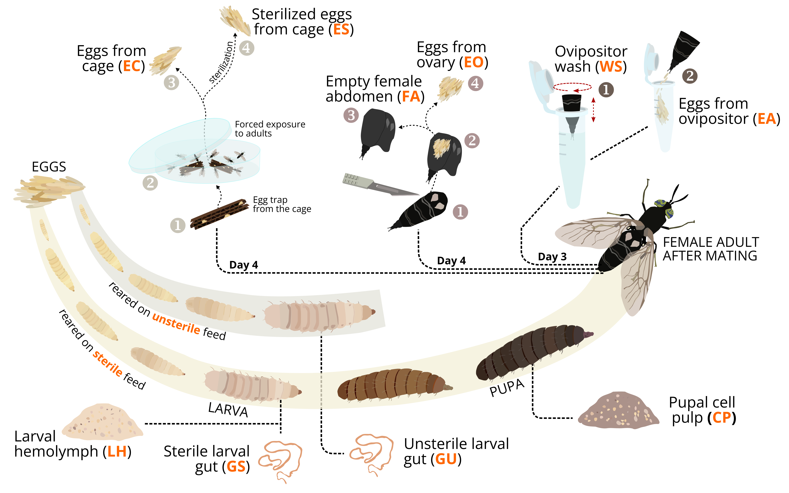

```{r setup, include=FALSE}
knitr::opts_chunk$set(echo = TRUE)
```

<style>
  p.comment {
  background-color: #FCF9EE;
  padding: 10px;
  margin-left: 25px;
  margin-right: 50px;
  border-radius: 5px;
  }
</style>


Carina D. Heussler<sup>1, 2, †</sup>, Thomas Klammsteiner<sup>1, 2, †</sup>, Heribert Insam<sup>2</sup>, Birgit C. Schlick-Steiner<sup>1</sup>, Florian M. Steiner<sup>1</sup>

<sup>1</sup>Department of Ecology, University of Innsbruck, Innsbruck, Austria  
<sup>2</sup>Department of Microbiology, University of Innsbruck, Innsbruck, Austria  

<sup>†</sup> <i>equal contribution</i>

<br/>

This website provides reproducible documentation for the methods and tools used to process and analyze the sequence data from our study on decrypting the microbiota during black soldier fly reproduction and oviposition. The work was conducted by the [Black Soldier Fly working group Innsbruck](https://www.fromwastetofeed.com).  

<br/>

To cite these data:  

<p class="comment">
Heussler, C.D., Klammsteiner, T., Insam, H., Schlick-Steiner, B.C., Steiner, F.M. (2022). *Decrypting the microbiota on the black soldier fly’s embryo surface and their origin during development*. URL: [https://tklammsteiner.github.io/eggsurfacemicrobiome](https://tklammsteiner.github.io/eggsurfacemicrobiome)  
</p>

<br/>
<br/>

<center>
  
  <figure>
    
    
    
    <figcaption align = "center">
    
      <b>Fig. 1 - Visualization of the experimental design. Circled numbers indicate the main steps to obtain samples from various tissues and developmental stages of the black soldier fly. Orange uppercase letters describe the abbrevations for these samples.</b>
    
    </figcaption>
  
  <figure>
  
  <br/>
  <br/>
  <br/>
  
  <a href="https://www.fromwastetofeed.com">
  
    
    
  </a>  
  
  [www.fromwastetofeed.com](https://www.fromwastetofeed.com)
  
</center>