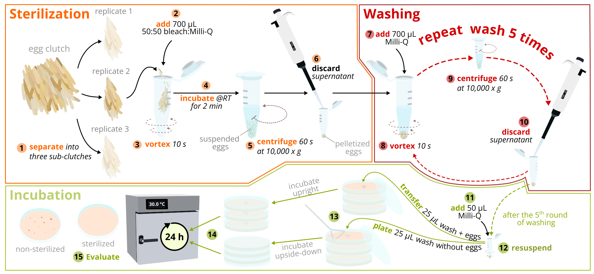
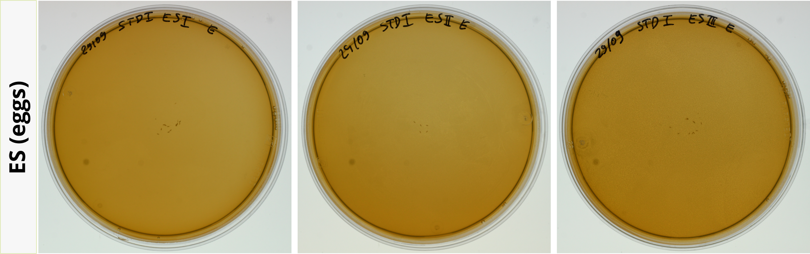
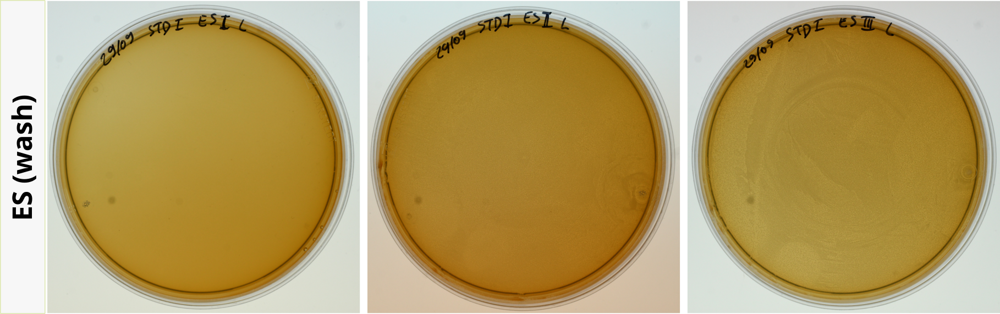
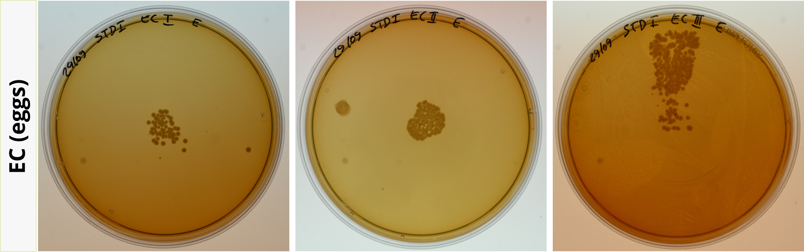
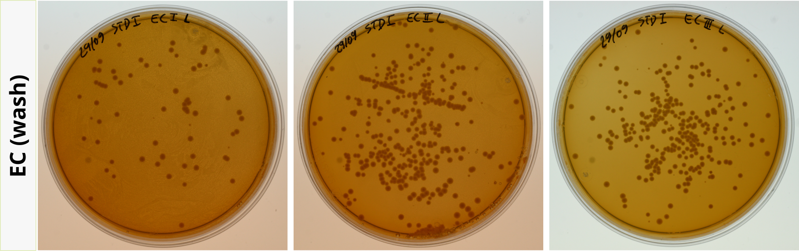

  

        
<figcaption align = "center">
    <b>Fig. 1</b> - Egg sterilization workflow.  
</figcaption>
    

*click figure to see larger version*

  
  
    

        
<figcaption align = "center">
    <b>Fig. 2</b> - Sterilized eggs placed on standard I nutrient agar and incubated at 30 °C for 24 h.  
</figcaption>
    

*click figure to see larger version*

  
  
    

        
<figcaption align = "center">
    <b>Fig. 3</b> - Wash from sterilized eggs plated on standard I nutrient agar and incubated at 30 °C for 24 h.  
</figcaption>
    

*click figure to see larger version*

  
  
    

        
<figcaption align = "center">
    <b>Fig. 4</b> - Non-sterilized eggs placed on standard I nutrient agar and incubated at 30 °C for 24 h.  
</figcaption>
    

*click figure to see larger version*

  
  
    

        
<figcaption align = "center">
    <b>Fig. 2</b> - Wash from non-sterilized eggs plated on standard I nutrient agar and incubated at 30 °C for 24 h.  
</figcaption>
    

*click figure to see larger version*

  
  
    